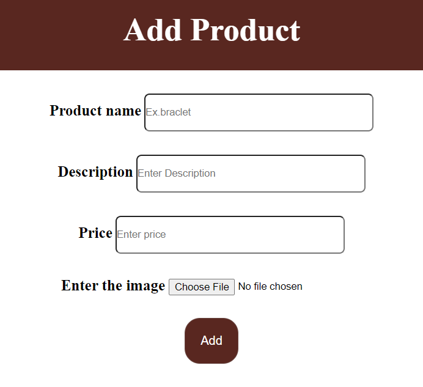

# E-commerce Stunning Accessories Store Project

## Table of Contents

- [Introduction](#introduction)
- [Project Overview](#project-overview)
- [Features](#features)
  - [User Features](#user-features)
  - [Admin Features](#admin-features)
- [Technologies Used](#technologies-used)
- [Installation Instructions](#installation-instructions)
- [Usage Instructions](#usage-instructions)
- [File Structure and Explanation](#file-structure-and-explanation)
- [Database Schema](#database-schema)
  - [Product Table](#product-table)
  - [User Table](#user-table)
- [Detailed Code Explanation](#detailed-code-explanation)
  - [Database Connection (`connection.php`)](#database-connection-connectionphp)
  - [User Registration (`signup.php`)](#user-registration-signupphp)
  - [User Login (`login.php`)](#user-login-loginphp)
  - [Product Display (`products.php`)](#product-display-productsphp)
  - [Add New Product (`add.php` and `add.css`)](#add-new-product-addphp-and-addcss)
  - [Update and Delete Products (`update.php`, `delete.php`, `allrecords.php`)](#update-and-delete-products-updatephp-deletephp-allrecordsphp)
  - [Additional Pages](#additional-pages)
    - [Contact Us (`Contact us.html`, `contact us.css`)](#contact-us-contact-ushtml-contact-uscss)
    - [Survey (`survey.html`, `survey.css`)](#survey-surveyhtml-surveycss)
    - [Checkout (`check.html`)](#checkout-checkhtml)
  - [Footer and Homepage Styling (`footer.css`, `homepage.css`)](#footer-and-homepage-styling-footercss-homepagecss)
- [Screenshots](#screenshots)
- [Future Enhancements](#future-enhancements)
- [Contributors](#contributors)
- [Contact Information](#contact-information)

## Introduction

Welcome to the **E-commerce Accessories Store** project, an online platform dedicated to selling accessories. This project provides a seamless shopping experience for users and an efficient management system for administrators. Built using PHP, MySQL, HTML, and CSS, the platform ensures reliable performance and a user-friendly interface.

In the modern digital era, e-commerce platforms play a significant role in connecting businesses with customers worldwide. This project aims to demonstrate the development of a full-fledged e-commerce website, focusing on accessories, with features that cater to both customers and administrators.

## Project Overview

The E-commerce Accessories Store is a web-based application that allows users to browse and purchase various accessories online. Users can create accounts, log in, add products to their shopping cart, and proceed to checkout securely. Administrators have special privileges to manage products, view all records, and perform administrative tasks.

The platform includes features such as user authentication, product management, shopping cart functionality, secure checkout, and additional informational pages like Contact Us and Survey forms. The design emphasizes user experience with intuitive navigation and responsive layouts.

## Features

### User Features

- **User Registration and Login**:
  - Secure system for users to create accounts and authenticate.
  - Passwords are hashed for security.
  - Validation checks for input fields to ensure data integrity.

- **Product Browsing**:
  - View all available accessories with images, descriptions, and prices.
  - Search and filter options to find specific products.
  - Responsive design for optimal viewing on various devices.

- **Shopping Cart**:
  - Add products to a cart and manage item quantities.
  - View cart summary with total prices.
  - Remove items or update quantities before checkout.

- **Checkout Process**:
  - Secure form for entering payment details.
  - Order confirmation upon successful transaction.
  - Input validation to ensure accurate data entry.

- **Contact Us Page**:
  - Provides users with ways to reach out for support or inquiries.
  - Displays company information like address, phone number, and email.

- **Survey Page**:
  - Collects user feedback to improve the platform.
  - Includes questions about user experience and suggestions.

### Admin Features

- **Product Management**:
  - Add new products with details like name, description, price, and image.
  - Update existing product information.
  - Delete products from the inventory.

- **View All Products**:
  - Administrators can see all products in a table format.
  - Options to edit or delete each product directly from the list.

- **User Management**:
  - Monitor user accounts and activity.
  - Potential to implement features like blocking users or resetting passwords.

- **Security**:
  - Admin area protected by authentication.
  - Only authorized personnel can access administrative functionalities.

## Technologies Used

- **Front-End**:
  - HTML5: Structuring the web content.
  - CSS3: Styling and layout of web pages.
  - Responsive Design Techniques for mobile compatibility.

- **Back-End**:
  - PHP: Server-side scripting for dynamic content.
  - MySQL: Relational database management.

- **Tools and Platforms**:
  - Apache Server (via XAMPP or similar).
  - phpMyAdmin for database management.
  - IDE or code editor like VSCode or Sublime Text.

- **Security Measures**:
  - Input validation to prevent SQL injection and XSS attacks.
  - Password hashing using PHP's password_hash function.

## Installation Instructions

1. **Clone the Repository**:

   ```bash
   git clone https://github.com/DanielSamy/accessories-store.git
   ```

2. **Setup Database**:

   - Use phpMyAdmin or MySQL command line to import `accessories.sql` into your MySQL server.
   - Create a database named `accessories` if it doesn't exist.

3. **Configure Database Connection**:

   - Open `connection.php`.
   - Ensure the database credentials match your local setup:

     ```php
     <?php
     $database = mysqli_connect('localhost', 'root', '', 'accessories');
     if (!$database) {
         die("Connection failed: " . mysqli_connect_error());
     }
     ?>
     ```

4. **Place the Project in Your Server Directory**:

   - Move the project files to your web server directory (e.g., `htdocs` for XAMPP).

5. **Start the Server**:

   - Run Apache and MySQL services via XAMPP or your preferred method.

6. **Access the Website**:

   - Open your web browser and navigate to `http://localhost/accessories-store/index.php`.

## Usage Instructions

### User Registration

- Navigate to the **Sign Up** page (`signup.php`).
- Fill out the registration form with your name, email, and password.
- Submit the form to create a new account.
- Ensure your password meets the minimum security requirements.

### User Login

- Navigate to the **Login** page (`login.php`).
- Enter your registered email and password.
- Click "Login" to access your account.
- If you forget your password, use the "Forgot Password" link to recover it.

### Browsing Products

- Visit the **Products** page (`products.php`) to view available accessories.
- Use the search bar to find specific items by name or keyword.
- Filter products based on categories, price range, or popularity.

### Adding to Cart and Checkout

- Click on "Add to Cart" for the desired products.
- Review your cart by clicking on the cart icon or "View Cart" link.
- Update item quantities or remove items as needed.
- Proceed to the **Checkout** page (`check.html`).
- Enter your payment and shipping details securely.
- Submit the form to complete the purchase.
- You will receive an order confirmation.

### Admin Access

- Log in with administrator credentials (e.g., email: `daniel@gmail.com`, password: `daniel1234`).
- Access admin functionalities like adding, updating, or deleting products via the admin panel.
- Navigate to `allrecords.php` to view all products.

## File Structure and Explanation

```
accessories-store/
├── add.css
├── add.php
├── allrec.css
├── allrecords.php
├── check.html
├── connection.php
├── contact us.css
├── Contact us.html
├── delete.php
├── footer.css
├── homepage.css
├── images/
│   ├── 1.jpg
│   ├── 2.jpg
│   └── ...
├── index.php
├── login.php
├── logout.php
├── products.php
├── signup.css
├── signup.php
├── survey.css
├── survey.html
├── update.css
├── update.php
└── accessories.sql
```

### Explanation of Key Files

- **`index.php`**: The homepage of the website. It introduces users to the platform and provides navigation links.

- **`connection.php`**: Contains the code to establish a connection with the MySQL database.

- **`signup.php` and `signup.css`**: Handles user registration and includes the styling for the signup page.

- **`login.php`**: Manages user authentication and login sessions.

- **`products.php`**: Displays products fetched from the database to the users.

- **`add.php` and `add.css`**: Allows administrators to add new products to the store. The CSS file styles the add product form.

- **`update.php` and `update.css`**: Enables administrators to update existing product details. The CSS file styles the update form.

- **`delete.php`**: Processes the deletion of products from the inventory.

- **`allrecords.php` and `allrec.css`**: Admin page that lists all products with options to update or delete. The CSS file styles the product table.

- **`check.html`**: The checkout page where users enter payment information.

- **`Contact us.html` and `contact us.css`**: Provides users with contact information and a way to reach out to the business.

- **`survey.html` and `survey.css`**: Collects user feedback through a survey form.

- **`footer.css` and `homepage.css`**: Contains styling for the footer and homepage respectively.

- **`accessories.sql`**: SQL dump of the database, including table structures and sample data.

## Database Schema

### Product Table

- **Table Name**: `product`
- **Fields**:
  - `id` (int, primary key, auto-increment): Unique identifier for each product.
  - `productName` (varchar(50)): Name of the product.
  - `description` (varchar(200)): Detailed description of the product.
  - `price` (float): Price of the product.
  - `image` (varchar(50)): Filename of the product image.

### User Table

- **Table Name**: `user`
- **Fields**:
  - `id` (int, primary key, auto-increment): Unique identifier for each user.
  - `name` (varchar(50)): User's full name.
  - `email` (varchar(50)): User's email address (used for login).
  - `pass` (varchar(255)): User's password (hashed for security).

## Detailed Code Explanation

### Database Connection (`connection.php`)

This file establishes a connection to the MySQL database using PHP's `mysqli_connect` function.

```php
<?php
// connection.php

$database = mysqli_connect('localhost', 'root', '', 'accessories');

if (!$database) {
    die("Connection failed: " . mysqli_connect_error());
}
?>
```

- **Parameters**:
  - `'localhost'`: The server where the database is hosted.
  - `'root'`: The username for the database (default for local servers).
  - `''`: The password for the database (empty if not set).
  - `'accessories'`: The name of the database.

### User Registration (`signup.php`)

Handles the registration of new users and inserts their data into the `user` table.

```php
<?php
include("connection.php");

if (isset($_POST["register"])) {
    $username = mysqli_real_escape_string($database, $_POST['name']);
    $mail = mysqli_real_escape_string($database, $_POST['email']);
    $pass = mysqli_real_escape_string($database, $_POST['pass']);
    $confirm = mysqli_real_escape_string($database, $_POST['conpass']);

    // Check if email already exists
    $check_query = "SELECT * FROM user WHERE email = '$mail'";
    $check_result = mysqli_query($database, $check_query);

    if (mysqli_num_rows($check_result) > 0) {
        echo "Email is already taken";
    } else {
        // Validate input fields
        $errors = array();

        if (empty($username)) {
            $errors[] = "Username is required";
        }
        if (empty($mail)) {
            $errors[] = "Email is required";
        }
        if (empty($pass)) {
            $errors[] = "Password is required";
        }
        if ($pass != $confirm) {
            $errors[] = "Passwords do not match";
        }

        if (empty($errors)) {
            // Hash the password before storing
            $hashed_pass = password_hash($pass, PASSWORD_DEFAULT);

            // Insert user into database
            $insert_query = "INSERT INTO user (name, email, pass) VALUES ('$username', '$mail', '$hashed_pass')";
            $insert_result = mysqli_query($database, $insert_query);

            if ($insert_result) {
                echo "<script>alert('User registered successfully')</script>";
                header('Location: login.php');
                exit();
            } else {
                echo "Error: " . mysqli_error($database);
            }
        } else {
            foreach ($errors as $error) {
                echo $error . "<br>";
            }
        }
    }
}
?>
```

- **Security Measures**:
  - **Input Sanitization**: Using `mysqli_real_escape_string` to prevent SQL injection.
  - **Password Hashing**: Using `password_hash` to securely store passwords.
  - **Email Check**: Ensuring that the email is not already registered.

### User Login (`login.php`)

Authenticates users and starts a session.

```php
<?php
include("connection.php");

session_start();

if (isset($_POST['login'])) {
    $email = mysqli_real_escape_string($database, $_POST['email']);
    $password = $_POST['pass'];

    if (empty($email) || empty($password)) {
        echo "Email and Password are required";
    } else {
        $query = "SELECT * FROM user WHERE email = '$email'";
        $result = mysqli_query($database, $query);

        if (mysqli_num_rows($result) == 1) {
            $user = mysqli_fetch_assoc($result);

            // Verify password
            if (password_verify($password, $user['pass'])) {
                $_SESSION['email'] = $email;

                if ($email == "daniel@gmail.com") {
                    header('Location: allrecords.php'); // Admin panel
                } else {
                    header('Location: products.php');
                }
                exit();
            } else {
                echo "Incorrect Password";
            }
        } else {
            echo "Email not registered";
        }
    }
}
?>
```

- **Session Management**:
  - Starts a session to keep the user logged in.
  - Stores the user's email in the session.

- **Password Verification**:
  - Uses `password_verify` to check the entered password against the hashed password in the database.

### Product Display (`products.php`)

Fetches and displays products from the database to the users.

```php
<?php
include("connection.php");

$query = "SELECT * FROM product";
$records = mysqli_query($database, $query);
?>

<!DOCTYPE html>
<html>
<head>
    <!-- Include CSS and other head elements -->
</head>
<body>
    <h1>Our Products</h1>
    <div class="product-grid">
        <?php while ($data = mysqli_fetch_array($records)) { ?>
            <div class="product">
                " alt="<?php echo $data['productName']; ?>">
                <h2><?php echo $data['productName']; ?></h2>
                <p><?php echo $data['description']; ?></p>
                <p>Price: <?php echo $data['price']; ?> L.E.</p>
                <a href="add_to_cart.php?id=<?php echo $data['id']; ?>">Add to Cart</a>
            </div>
        <?php } ?>
    </div>
</body>
</html>
```

- **Dynamic Content**:
  - Uses a `while` loop to iterate over the fetched products and display them.
  - Retrieves product details like image, name, description, and price.

- **User Interaction**:
  - Provides an "Add to Cart" link for each product.

### Add New Product (`add.php` and `add.css`)

Allows administrators to add new products to the store.

**`add.php`**

```php
<?php
include('connection.php');

session_start();

// Check if user is admin
if ($_SESSION['email'] != 'daniel@gmail.com') {
    header('Location: login.php');
    exit();
}

if (isset($_POST['add'])) {
    $productName = mysqli_real_escape_string($database, $_POST['productName']);
    $description = mysqli_real_escape_string($database, $_POST['description']);
    $price = mysqli_real_escape_string($database, $_POST['price']);
    $image = $_FILES['image']['name'];

    // Upload image
    $target = "images/" . basename($image);
    if (move_uploaded_file($_FILES['image']['tmp_name'], $target)) {
        // Insert product into database
        $insert = "INSERT INTO product (productName, description, price, image) VALUES ('$productName', '$description', '$price', '$image')";
        $run_insert = mysqli_query($database, $insert);

        if ($run_insert) {
            echo "<script>alert('Product Added Successfully')</script>";
        } else {
            echo "Error adding product: " . mysqli_error($database);
        }
    } else {
        echo "Failed to upload image";
    }
}
?>
```

- **File Upload Handling**:
  - Uses `$_FILES` to handle image uploads.
  - Moves the uploaded file to the `images/` directory.

- **Security**:
  - Checks if the user is an admin before allowing access.

### Update and Delete Products (`update.php`, `delete.php`, `allrecords.php`)

**`update.php`**

Allows administrators to update existing product details.

```php
<?php
include("connection.php");

session_start();

// Check if user is admin
if ($_SESSION['email'] != 'daniel@gmail.com') {
    header('Location: login.php');
    exit();
}

$id = $_GET['id'];
$selectQry = mysqli_query($database, "SELECT * FROM product WHERE id = '$id'");
$data = mysqli_fetch_array($selectQry);

if (isset($_POST['update'])) {
    $productName = mysqli_real_escape_string($database, $_POST['productName']);
    $description = mysqli_real_escape_string($database, $_POST['description']);
    $price = mysqli_real_escape_string($database, $_POST['price']);
    $image = $_FILES['image']['name'];

    if ($image != "") {
        // Upload new image
        $target = "images/" . basename($image);
        move_uploaded_file($_FILES['image']['tmp_name'], $target);
    } else {
        // Keep existing image
        $image = $data['image'];
    }

    $updateQry = "UPDATE product SET productName='$productName', description='$description', price='$price', image='$image' WHERE id='$id'";
    $edit = mysqli_query($database, $updateQry);

    if ($edit) {
        header("Location: allrecords.php");
        exit();
    } else {
        echo "Error updating product: " . mysqli_error($database);
    }
}
?>
```

**`delete.php`**

Processes the deletion of products.

```php
<?php
include("connection.php");

session_start();

// Check if user is admin
if ($_SESSION['email'] != 'daniel@gmail.com') {
    header('Location: login.php');
    exit();
}

$id = $_GET['id'];
$deleteQry = "DELETE FROM product WHERE id='$id'";
$del = mysqli_query($database, $deleteQry);

if ($del) {
    header("Location: allrecords.php");
    exit();
} else {
    echo "Error deleting product: " . mysqli_error($database);
}
?>
```

**`allrecords.php`**

Displays all products to the administrator with options to update or delete.

```php
<?php
include("connection.php");

session_start();

// Check if user is admin
if ($_SESSION['email'] != 'daniel@gmail.com') {
    header('Location: login.php');
    exit();
}

$records = mysqli_query($database, "SELECT * FROM product");
?>

<!DOCTYPE html>
<html>
<head>
    <!-- Include CSS -->
</head>
<body>
    <h1>Product Details</h1>
    <table>
        <tr>
            <th>ID</th>
            <th>Product Name</th>
            <th>Description</th>
            <th>Price</th>
            <th>Image</th>
            <th>Update</th>
            <th>Delete</th>
        </tr>
        <?php while ($data = mysqli_fetch_array($records)) { ?>
            <tr>
                <td><?php echo $data['id']; ?></td>
                <td><?php echo $data['productName']; ?></td>
                <td><?php echo $data['description']; ?></td>
                <td><?php echo $data['price']; ?></td>
                <td>" width="100"></td>
                <td><a href="update.php?id=<?php echo $data['id']; ?>">Update</a></td>
                <td><a href="delete.php?id=<?php echo $data['id']; ?>" onclick="return confirm('Are you sure?');">Delete</a></td>
            </tr>
        <?php } ?>
    </table>
</body>
</html>
```

- **Admin Interface**:
  - Displays products in a table with options to edit or delete.
  - Includes confirmation prompt before deletion.

### Additional Pages

#### Contact Us (`Contact us.html`, `contact us.css`)

Provides users with contact information.

- **`Contact us.html`**

```html
<!DOCTYPE html>
<html>
<head>
    <title>Contact Us</title>
    <link rel="stylesheet" href="contact us.css">
</head>
<body>
    <h1>Contact Us</h1>
    <p>
        Stunning Accessories by Hend was established in 2018.<br>
        100% Handmade accessories made with love and passion trying to satisfy all our beloved customers.
    </p>
    <h2>Get in Touch</h2>
    <ul>
        <li>Location: 7 Farid Shawky, Mohandeseen</li>
        <li>Phone Number: 011588763054</li>
        <li>Email: StunningAccessories@gmail.com</li>
    </ul>
</body>
</html>
```

- **Information Provided**:
  - Company background.
  - Contact details including address, phone number, and email.

#### Survey (`survey.html`, `survey.css`)

Collects user feedback.

- **`survey.html`**

```html
<!DOCTYPE html>
<html>
<head>
    <title>Customer Survey</title>
    <link rel="stylesheet" href="survey.css">
</head>
<body>
    <h1>Customer Satisfaction Survey</h1>
    <form action="submit_survey.php" method="post">
        <!-- Survey questions -->
        <label>Name:</label>
        <input type="text" name="name"><br>
        <!-- More questions -->
        <input type="submit" value="Submit">
    </form>
</body>
</html>
```

- **Purpose**:
  - Gather feedback to improve services.
  - Understand customer preferences.

#### Checkout (`check.html`)

Facilitates the checkout process.

```html
<!DOCTYPE html>
<html>
<head>
    <title>Checkout</title>
</head>
<body>
    <h1>Checkout</h1>
    <form action="process_payment.php" method="post">
        <label>Card Name:</label>
        <input type="text" name="card_name"><br>
        <label>Card Number:</label>
        <input type="text" name="card_number"><br>
        <label>CVV:</label>
        <input type="text" name="cvv"><br>
        <!-- Additional fields -->
        <input type="submit" value="Pay Now">
    </form>
</body>
</html>
```

- **Security Considerations**:
  - In a real-world application, ensure SSL encryption.
  - Use payment gateways to handle transactions.

### Footer and Homepage Styling (`footer.css`, `homepage.css`)

Enhances the visual appearance of the website.

- **`footer.css`**: Styles the footer section with social media icons and contact information.

- **`homepage.css`**: Styles the navigation menu, header, and general layout of the homepage.

## Screenshots

- **Home Page**:

  

- **Sign Up Page**:

  

- **Login Page**:

  

- **Products Page**:

  

- **Shopping Cart**:

  

- **Admin Panel**:

  

- **Add Product Page**:

  

- **Update Product Page**:

  

## Future Enhancements

- **Payment Gateway Integration**:
  - Implement secure payment processing using services like PayPal or Stripe.
  - Ensure compliance with PCI DSS standards.

- **User Profiles**:
  - Allow users to edit their profiles and view order history.
  - Implement profile pictures and preferences.

- **Product Reviews and Ratings**:
  - Enable users to leave feedback on products.
  - Display average ratings on product pages.

- **Wishlist Feature**:
  - Users can save products for future consideration.
  - Send reminders or notifications for wishlist items.

- **Enhanced Security**:
  - Use prepared statements or PDO for database interactions.
  - Implement HTTPS across the entire site.

- **Mobile Application**:
  - Develop a mobile app for Android and iOS platforms.
  - Synchronize with the web platform.

- **Advanced Search and Filters**:
  - Implement advanced search algorithms.
  - Provide filters based on more attributes like color, size, material.

- **AI-driven Recommendations**:
  - Use machine learning to recommend products based on user behavior.

## Contributors

- **[Daniel Samy]** - Developer and Designer

## Contact Information

For any inquiries or support, please contact:

- **Email**: [StunningAccessories@gmail.com](mailto:StunningAccessories@gmail.com)
- **Phone**: 011588763054
- **Address**: 7 Farid Shawky, Mohandeseen, Cairo, Egypt

---

*Thank you for your interest in the E-commerce Accessories Store Project! We hope this documentation provides a clear understanding of the project's functionality and structure. Feel free to reach out for any questions or collaboration opportunities.*
```